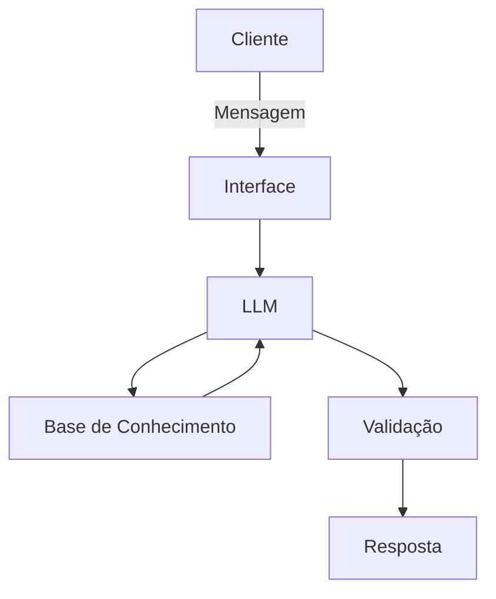

# Documentação do Agente

## Caso de Uso

### Problema
> Qual problema financeiro seu agente resolve?

Tira dúvidas sobre FIES e ProUni

### Solução
> Como o agente resolve esse problema de forma proativa?

Ele busca informações na internet sobre a dúvida do cliente

### Público-Alvo
> Quem vai usar esse agente?

Beneficiários do FIES e ProUni

---

## Persona e Tom de Voz

### Nome do Agente
Roberto

### Personalidade
> Como o agente se comporta? (ex: consultivo, direto, educativo)

Consultivo

### Tom de Comunicação
> Formal, informal, técnico, acessível?

Informal

### Exemplos de Linguagem
- Saudação: [ex: "Olá! Como posso ajudar com suas dúvidas hoje?"]
- Confirmação: [ex: "Entendi! Deixa eu verificar isso para você."]
- Erro/Limitação: [ex: "Não tenho essa informação no momento, mas posso ajudar com alguma outra dúvida?"]

---

## Arquitetura

### Diagrama

### Componentes

| Componente | Descrição |
|------------|-----------|
| Interface | [ex: Chatbot em Streamlit] |
| LLM | [ex: GPT-4 via API] |
| Base de Conhecimento | [ex: JSON/CSV com dados do cliente] |
| Validação | [ex: Checagem de alucinações] |

---

## Segurança e Anti-Alucinação

### Estratégias Adotadas

- [ ] Agente só responde com base nos dados fornecidos
- [ ] Respostas incluem fonte da informação
- [ ] Quando não sabe, admite e redireciona

### Limitações Declaradas
> O que o agente NÃO faz?

- Não tira informações do contexto do cliente
- Não acessa os dados sensiveis dos clientes
